  

  <a href="https://orkestera.com"><b>orkestera.com</b></a> &nbsp;·&nbsp;
  <a href="https://edos.io"><b>edos.io</b></a> &nbsp;·&nbsp;
  <a href="mailto:travis@edos.io"><b>travis@edos.io</b></a>

---

We build software that turns goals into finished, verified work, and we build the controls that let an organization trust it.

EDOS began as a delivery consultancy: release pipelines, distributed systems, security, and observability for engineering teams at scale. We carried the pagers. That discipline is now a product. Our team is small and senior, with more than ninety years of combined experience in tech, and every one of us has thirty or more, and our standard has not changed: **ship things that work, or don't ship them.**

## Orkestera

**The agentic workflow management suite.** Orkestera is our flagship and the center of our R&D.

You state a goal. Orkestera decomposes it into tasks, plans each as a graph, executes every node, and scores the result against the goal before it counts as done. Every action is observable while it happens, and every control-plane change is recorded.

| | |
|---|---|
| **Ork Chat** | Goal intake in conversation. Turn intent into dispatched, tracked work. |
| **GraphAgent engine** | A whole-graph planner and executor that plans, runs, and scores each node of the work. |
| **Watch** | Live observability: task boards, logs, inference traces, and side-by-side analysis of external agent runs. |
| **Governance** | OAuth 2.1, per-organization SSO, scoped service tokens, durable audit history, and org policy applied to connected clients. |
| **Inference routing** | Provider-agnostic. Priority fallback across hosted and self-hosted models. Swap the model, keep the workflow. |
| **Analytics** | Per-organization usage and outcome analysis over curated, deduplicated history. |

Orkestera runs in the cloud today across development, staging, and our own production environment, and it is built to run on-premises. Early access: **[orkestera.com](https://orkestera.com)**.

## Around the platform

**Commander 2: mission control on the desktop.**
A native control surface for running agent workflows on your own machine. Connected to Orkestera, it streams run telemetry to the organization and applies the organization's policy locally. Disconnected, it is fully local.

**dress-rehearsal: proof before production.**
Seeded simulation testing for Orkestera, Commander 2, and the contract between them. One seed is one run: the same clients, faults, outages, and policy changes, in the same order, every time. Every failure is a seed we can replay, and the harness proves itself by catching bugs we plant on purpose.

## Research

**Recursive self-improvement.**
A continuous improvement controller for quantized local models. Candidate components are proposed, trained, and quantized, then promoted only when they beat their parent on a sealed internal benchmark that keeps getting harder.

**Powdered Stars.**
A GPU-native 2D compressible hydrodynamics simulator in Rust and wgpu, with neutron and photon transport. Draw the starting conditions from a materials catalog, then watch pressure, energy, and radiation fields evolve live.

## How we work

- **A completed task is the only test.** Component checks are necessary. They are not sufficient. We promote on finished, verified work.
- **Reproducible or it didn't happen.** Failures become seeds, regressions become tests, and planted defects prove the tests catch them.
- **Humans near the loop.** Automation runs the loop. People set direction, approve results, and own the outcome.
- **No lock-in.** Provider-agnostic inference, standard protocols, and infrastructure as code.
- **Security first.** TLS on every boundary, encryption at rest, least-privilege service identities, and 2FA across the organization.

---

Enterprise DevOps Solutions LLC

